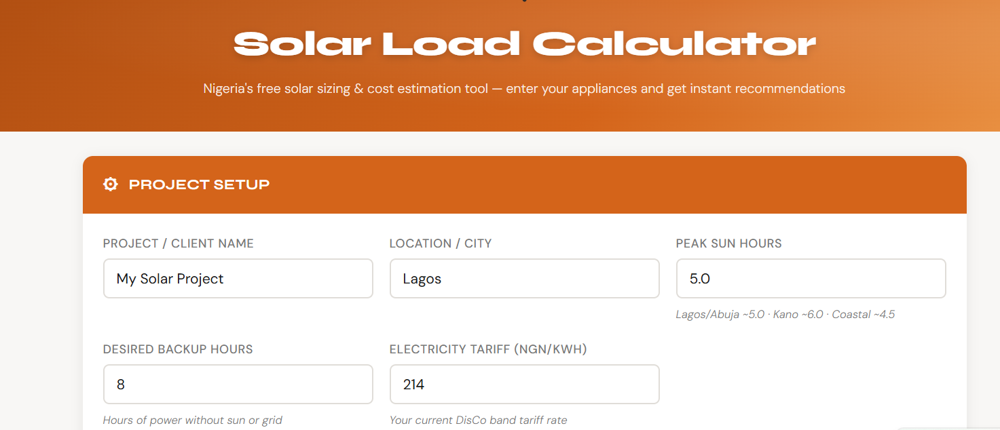

# ☀ Nigeria Solar Load Calculator

A free, open-source solar energy sizing and cost estimation tool built specifically for the Nigerian market.

**[🔗 Try it live →](https://YOUR-USERNAME.github.io/nigeria-solar-calculator)**



---

## What It Does

This tool helps homeowners, businesses, and solar installers in Nigeria quickly calculate:

- **Total energy consumption** — daily, weekly, monthly and annual kWh based on actual appliance usage
- **Night load** — identifies which appliances run on battery power at night using a simple toggle
- **Inverter size** — recommended kVA with 25% safety headroom (Deye, SRNE, Growatt compatible)
- **Battery bank capacity** — sized correctly based on night load × backup hours (LiFePO4, 80% DoD)
- **Solar array size** — total Wp needed with 550W and 625W panel options
- **Battery recharge time** — how long it takes your panels to recharge the battery on a typical day
- **Cost estimate** — auto-populated reference prices for inverter, battery and panels based on current Nigerian market rates, fully editable with your own supplier quotes

---

## Features

- ✅ Pre-filled with 26 common Nigerian household appliances
- ✅ Grouped by category (Lighting, Fans & Cooling, Kitchen, Electronics, Water & Pumping)
- ✅ Collapsible category sections
- ✅ Add / delete appliances per section
- ✅ 🌙 Night load toggle per appliance — correctly sizes battery for evening/night use
- ✅ Auto system voltage recommendation (24V or 48V) based on total load
- ✅ Reference market prices for key components (updated April 2026)
- ✅ Print and PDF download
- ✅ Works offline — single HTML file, no server or internet required after download
- ✅ Mobile friendly

---

## How To Use

1. Open `solar_calculator.html` in any modern web browser
2. Fill in your **Project Setup** (location, backup hours, peak sun hours, tariff)
3. In the **Appliance List**, set the **Qty** and **Hrs/Day** for each appliance you want to power
4. Toggle 🌙 **Night** on for appliances that will run from battery power in the evening/night
5. Click **⚡ Calculate** to generate your recommendations
6. Review the **Recommendations** — inverter size, battery kWh needed, solar array size
7. In the **Cost Estimator**, choose your panel wattage (550W or 625W) and update prices with your supplier quotes
8. Click **🖨 Print** or **⬇ Download PDF** to save your report

---

## Solar Sizing Logic

### Inverter
```
Recommended size = Total Running Watts × 1.25 (headroom)
Rounded up to nearest standard size: 1, 1.5, 2, 3, 3.6, 5, 7.5, 10, 12 kVA
```

### Battery Bank (LiFePO4)
```
Battery kWh = Night Load Watts × Backup Hours ÷ 0.95 (efficiency) ÷ 0.80 (DoD)
```
Battery is sized on **night load only** — appliances you toggled 🌙 on. During the day, solar panels power everything directly. The battery covers evening and night use until sunrise.

### Solar Panels
```
Total Wp = Daily kWh ÷ 0.90 (inverter eff.) ÷ 0.97 (CC eff.) × 1000 ÷ Peak Sun Hours ÷ 0.80 (derating)
Rounded up to nearest 100Wp
```
Panel sizing uses **full daily kWh** so the array can power all daytime loads AND recharge the battery within the available sun hours.

---

## Market Price References (Nigeria, April 2026)

Prices are indicative mid-market estimates. Always get fresh quotes — prices change with the USD/NGN rate.

| Component | Reference Price |
|---|---|
| Hybrid Inverter 3 kVA (SRNE/Growatt) | ~₦550,000 – ₦650,000 |
| Hybrid Inverter 5 kVA (Deye/SRNE) | ~₦1,000,000 – ₦1,200,000 |
| LiFePO4 Battery bank | ~₦190,000 per kWh nameplate |
| Solar Panel 550W (Jinko/LONGi) | ~₦100,000 – ₦171,000 |
| Solar Panel 625W (Canadian Solar/JA) | ~₦130,000 – ₦200,000 |

---

## Technology

- Pure HTML, CSS and JavaScript — no frameworks, no dependencies, no server
- Works completely offline once downloaded
- Google Fonts (Syne + DM Sans) loaded from CDN — app still works offline, just uses system fonts

---

## Contributing

Contributions are very welcome. Here's how:

**Reporting bugs or suggesting features**
1. Go to the [Issues tab](https://github.com/YOUR-USERNAME/nigeria-solar-calculator/issues)
2. Click **New Issue**
3. Describe the bug or feature request clearly

**Submitting code changes**
1. Fork this repository
2. Create a new branch: `git checkout -b feature/your-feature-name`
3. Make your changes to `solar_calculator.html`
4. Test it in a browser — check that calculations still work correctly
5. Submit a Pull Request with a clear description of what you changed and why

**Good first contributions**
- Updating reference prices as the market changes
- Adding more appliances to the default list
- Improving mobile layout
- Adding support for other African markets (Ghana, Kenya, South Africa)
- Translating labels to Yoruba, Hausa or Igbo

---

## Roadmap

- [ ] Save and load sessions (localStorage)
- [ ] Multiple scenario comparison
- [ ] Generator integration option
- [ ] Export to Excel / PDF with full layout
- [ ] Support for 3-phase systems
- [ ] Multi-language support

---

## Disclaimer

This calculator provides **estimates only**. Actual system requirements, component specifications and costs may vary based on site conditions, equipment brand, installation complexity and current market prices. This tool does not constitute professional engineering advice. Always consult a qualified and licensed solar installer before purchasing any equipment.

---

## License

MIT License — see [LICENSE](LICENSE) for details.

You are free to use, copy, modify, merge, publish, distribute, sublicense and sell copies of this software. The only requirement is that you include the copyright notice and license text in any copy or substantial portion of the software.

---

## Acknowledgements

Built with love for the Nigerian solar community 🇳🇬☀

If this tool helped you, consider starring the repo and sharing it with others.
